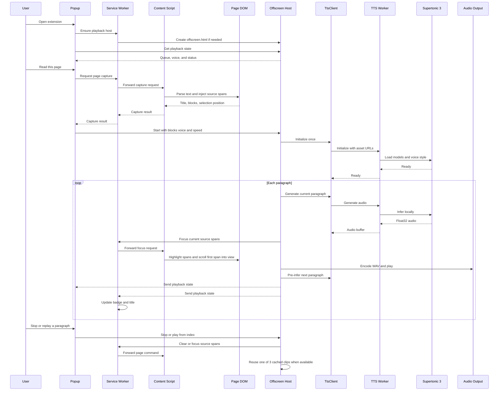

# hey read this page

A local Chrome page reader powered by Supertonic 3. Text and audio stay on your device.

> Note: I haven't written nor read a single LOC for this project (yet). I used gpt-5.6-terra high in Codex TUI, but I was still in the loop - tested the entire thing, described ideas, UI/UX, product logic, gave it error logs and feedback, and pretty much abused it until I was satisfied with the result. For inference, I gave it Supertonic 3's GitHub repo as reference.

## Build

```sh
pnpm install
pnpm run install-assets
pnpm build
```

Load `dist` as an unpacked extension in Chrome.

## Flow



Review in this order: `src/main.ts` (UI), `src/background.ts` (routing/lifecycle), `src/content.ts` and `src/page-capture.ts` (page DOM), then `src/offscreen.ts` (queue/playback), `src/tts-client.ts`, and `src/tts-worker.ts` (model execution).

## Credits

Uses [Supertonic 3](https://huggingface.co/Supertone/supertonic-3) by [Supertone Inc](https://www.supertone.ai/en).

## License

MIT
