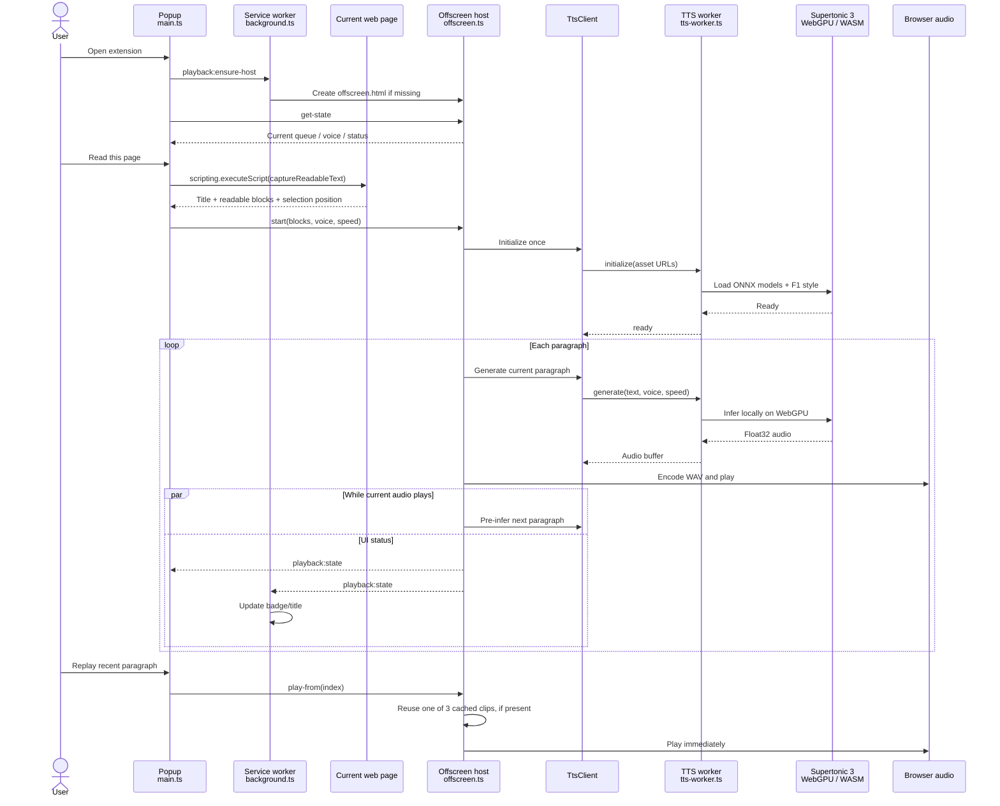

# Local Listen

A local Chrome page reader powered by Supertonic 3. Text and audio stay on your device.

## Build

```sh
pnpm install
pnpm run install-assets
pnpm build
```

Load `dist` as an unpacked extension in Chrome.

## Flow



## Credits

Uses [Supertonic 3](https://huggingface.co/Supertone/supertonic-3) by [Supertone Inc](https://www.supertone.ai/en).

## License

MIT

```

```
